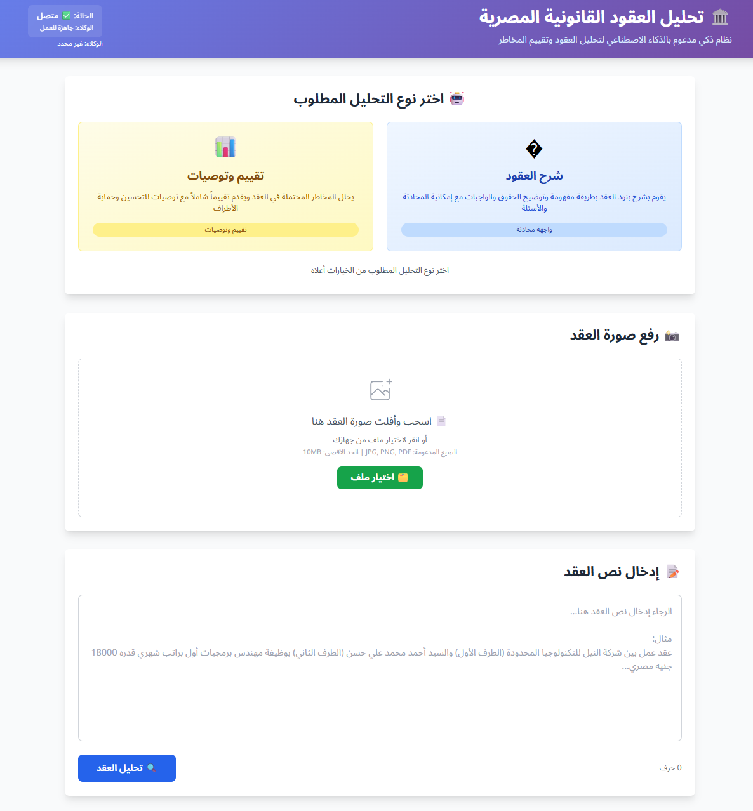
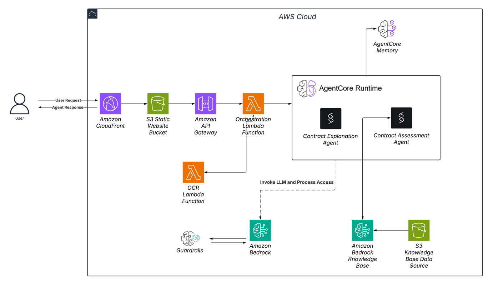

# 🏛️ Egyptian Legal Contract Analyzer - Tawtheeq AI
[](https://aws.amazon.com/)
[](https://python.org/)
[](https://aws.amazon.com/bedrock/)


<a id=""></a>

## **Contents**

- [Overview `⇧`](#overview-)
- [Features `⇧`](#key-features-)
- [Architecture `⇧`](#architecture-)
- [Deployment `⇧`](#deployment-)
- [Environment setup `⇧`](#environment-setup-)
- [Use Cases `⇧`](#use-cases-)

<a id="conventions-"></a>


## 🎯 Overview [`⇧`](#contents)

An advanced AI-powered system that analyzes Egyptian legal contracts using AWS services. It provides comprehensive legal analysis, compliance checking, and risk assessment for Arabic legal documents.

## 🌟Features [`⇧`](#contents)


1. **🔍 Advanced Arabic OCR**: High-accuracy text extraction from contract images
2. **🤖 Multi-Agent Analysis**: Specialized AI agents for different legal aspects
3. **⚖️ Egyptian Law Compliance**: Automated checking against Egyptian legal requirements
4. **🌐 Bilingual Support**: Analysis and reports in both Arabic and English
5. **⚡ Real-time Processing**: Fast analysis with cloud-native architecture
   



## 🏗️ Architecture [`⇧`](#contents)



This system processes user-submitted documents through a sophisticated pipeline that combines OCR, AI analysis, and knowledge management.

### Request Flow

1. **User Interaction**: Users submit requests through Amazon CloudFront (CDN for global content delivery)
2. **Static Content**: The S3 Static Website Bucket hosts the web interface
3. **API Gateway**: Amazon API Gateway handles incoming API requests and routes them appropriately
4. **Processing Trigger**: An Orchestration Lambda Function coordinates the document processing workflow

### Document Processing Pipeline

The **OCR Lambda Function** performs optical character recognition on uploaded documents, extracting text from images or scanned PDFs. This processed text is then passed to the core analysis engine.

### AgentCore Runtime

The heart of the system is the **AgentCore Runtime**, which contains two specialized AI agents:

* **Contract Explanation Agent**: Analyzes and explains contract terms and clauses
* **Contract Assessment Agent**: Evaluates contracts for risks, obligations, and key provisions

These agents leverage **Amazon Bedrock** (AWS's managed foundation model service) to perform sophisticated natural language understanding and generation tasks.

### Knowledge Management

The system incorporates:

* **Amazon Bedrock Knowledge Base**: Provides domain-specific knowledge and context
* **S3 Knowledge Base Data Source**: Stores reference documents and training data
* **Guardrails**: Ensures AI responses comply with defined safety and accuracy parameters

### Memory System

The **AgentCore Memory** component maintains context and conversation history, enabling more coherent multi-turn interactions.

### Key AWS Services Used

* **Amazon CloudFront**: Content delivery network
* **S3**: Object storage for static website and knowledge base
* **API Gateway**: RESTful API management
* **Lambda Functions**: Serverless compute for OCR and orchestration
* **Amazon Bedrock**: Managed AI/ML foundation models
* **Guardrails**: AI safety and compliance controls


### Contract Analysis Modes
- **Explanation Mode**: Detailed contract breakdown and explanation
- **Assessment Mode**: Risk assessment and legal recommendations
- **Interactive Chat**: Follow-up questions with session-based conversation memory

## 🚀 Quick Start [`⇧`](#contents)

### Prerequisites
- AWS Account with appropriate permissions
- Python 3.9+
- AWS CLI configured
- Access to AWS Bedrock AgentCore

### 1. Clone Repository
```bash
git clone [repository-url]
cd egyptian-legal-contract-analysis
```

### 2. Install Dependencies
```bash
pip install -r requirements.txt
```

### 3. Configure Environment
```bash
# Configure AWS CLI
aws configure

# Configure AgentCore
agentcore configure
```

### 4. Deploy Infrastructure
```bash
chmod +x deploy.sh
./deploy.sh
```

### 5. Deploy Lambda Functions
```bash
cd deployment

# Deploy main Lambda function
zip -r lambda-deployment.zip lambda_function.py
aws lambda create-function \
  --function-name egyptian-legal-contract-api \
  --runtime python3.9 \
  --role arn:aws:iam::YOUR-ACCOUNT:role/egyptian-legal-lambda-role \
  --handler lambda_function.lambda_handler \
  --zip-file fileb://lambda-deployment.zip

# Deploy OCR processor
zip -r ocr-deployment.zip ocr_processor.py
aws lambda create-function \
  --function-name ocr-processor \
  --runtime python3.9 \
  --role arn:aws:iam::YOUR-ACCOUNT:role/egyptian-legal-lambda-role \
  --handler ocr_processor.lambda_handler \
### 6. Deploy Website
```bash
# Upload website to S3
aws s3 cp production_website_aws.html s3://egyptian-legal-analysis-ui/production_website_aws.html

# Configure S3 for static website hosting
aws s3 website s3://egyptian-legal-analysis-ui --index-document production_website_aws.html
```

### 7. Configure API Gateway
Create API Gateway with the following endpoints:
- `GET /health` → Main Lambda
- `POST /api/analyze` → Main Lambda  
- `POST /api/ask` → Main Lambda
- `POST /api/ocr` → Main Lambda

Enable CORS for all endpoints.

##  Configuration [`⇧`](#contents)

### Required IAM Permissions
The Lambda execution role needs permissions for:
- Bedrock AgentCore access
- Lambda function invocation
- CloudWatch logging
- S3 bucket access (for knowledge base only)

### Environment Variables
Set these in your Lambda functions:
- `AWS_REGION=us-west-2`
- `KNOWLEDGE_BASE_ID=QJWEBKNQ1N`

### Agent ARNs
Update these in `deployment/lambda_function.py`:
- Explanation Agent: `arn:aws:bedrock-agentcore:us-west-2:YOUR-ACCOUNT:runtime/memoryenhancedexplanation-XXXXX`
- Assessment Agent: `arn:aws:bedrock-agentcore:us-west-2:YOUR-ACCOUNT:runtime/memoryenhancedassessment-XXXXX`

##  API Documentation [`⇧`](#contents)

### Health Check
```http
GET /health
Response: {"status": "healthy", "service": "Egyptian Legal Contract Analysis API"}
```

### Contract Analysis
```http
POST /api/analyze
Content-Type: application/json

{
  "analysis_type": "explanation|assessment",
  "contract_text": "نص العقد...",
  "user_id": "optional_user_id"
}
```

### Follow-up Questions
```http
POST /api/ask
Content-Type: application/json

{
  "question": "ما هي حقوق الموظف؟",
  "contract_text": "نص العقد...",
  "user_id": "user_id",
  "session_id": "session_id"
}
```

### OCR Processing
```http
POST /api/ocr
Content-Type: application/json

{
  "image_data": "data:image/jpeg;base64,/9j/4AAQ...",
  "auto_analyze": true,
  "analysis_type": "explanation"
}
```

##  Egyptian Law Knowledge Base [`⇧`](#contents)

Our system includes a list of comprehensive knowledge (for testing):
- **قانون العمل رقم 12 لسنة 2003** (Labor Law No. 12/2003)
- **القانون المدني المصري** (Egyptian Civil Code)  
- **قوانين العقارات والإيجارات** (Real Estate & Rental Laws)
- **القوانين التجارية** (Commercial Laws)
- **السوابق القضائية** (Legal Precedents)

##  Live Demo [`⇧`](#contents)

- **Website**: http://egyptian-legal-analysis-ui.s3-website-us-west-2.amazonaws.com/
- **API Base URL**: https://820uxym01d.execute-api.us-west-2.amazonaws.com/prod

## Usage Examples [`⇧`](#contents)

### 1. Contract Upload and Analysis
1. Visit the website
2. Select analysis type (Explanation or Assessment)
3. Upload contract image or paste text
4. Click "تحليل العقد" to get AI-powered analysis

### 2. Interactive Q&A
1. After analysis, ask follow-up questions
2. Get detailed responses based on contract content
3. Continue conversation with context preservation

### 3. OCR Text Extraction
1. Upload contract image
2. Click "استخراج النص ومعالجته"
3. Get extracted Arabic text
4. Optionally run automatic analysis

##  Monitoring and Debugging [`⇧`](#contents)

### CloudWatch Logs
Monitor the following log groups:
- `/aws/lambda/egyptian-legal-contract-api`
- `/aws/lambda/ocr-processor`

### Common Issues
1. **AgentCore Not Available**: Check agent deployment and ARNs
2. **OCR Failures**: Verify image format and size
3. **CORS Errors**: Ensure proper API Gateway CORS configuration
4. **Memory Issues**: Increase Lambda memory allocation


# Environment setup [`⇧`](#contents)

1. First and foremost, please see the suggested IDE setup in the dropdown below to make sure that your editor is ready for development.

> [!IMPORTANT]
>
> <details><summary>Suggested IDE setup</summary>
>
> <p>
>
> VS Code
>
> Install the following extensions:
>
> - [charliermarsh.ruff](https://marketplace.visualstudio.com/items?itemName=charliermarsh.ruff)
> - [streetsidesoftware.code-spell-checker](https://marketplace.visualstudio.com/items?itemName=streetsidesoftware.code-spell-checker)
>
> </p>
> </details>

1. [Fork](https://docs.github.com/en/get-started/quickstart/fork-a-repo) the [AI-Legal-Checker repo](https://github.com/activist-org/AI-Legal-Checker), clone your fork, and configure the remotes:

> [!NOTE]
>
> <details><summary>Consider using SSH</summary>
>
> <p>
>
> Alternatively to using HTTPS as in the instructions below, consider SSH to interact with GitHub from the terminal. SSH allows you to connect without a user-pass authentication flow.
>
> To run git commands with SSH, remember then to substitute the HTTPS URL, `https://github.com/...`, with the SSH one, `git@github.com:...`.
>
> - e.g. Cloning now becomes `git clone git@github.com:<your-username>/AI-Legal-Checker.git`
>
> GitHub also has their documentation on how to [Generate a new SSH key](https://docs.github.com/en/authentication/connecting-to-github-with-ssh/generating-a-new-ssh-key-and-adding-it-to-the-ssh-agent) 🔑
>
> </p>
> </details>

```bash
# Clone your fork of the repo into the current directory.
git clone https://github.com/<your-username>/AI-Legal-Checker
# Navigate to the newly cloned directory.
cd AI-Legal-Checker
# Assign the original repo to a remote called "upstream".
git remote add upstream https://github.com/activist-org/AI-Legal-Checker
```

- Now, if you run `git remote -v` you should see two remote repositories named:
  - `origin` (forked repository)
  - `upstream` (AI-Legal-Checker repository)

3. Create a virtual environment, activate it and install dependencies:

   ```bash
   # Unix or MacOS:
   python3 -m venv venv
   source venv/bin/activate

   # Windows:
   python -m venv venv
   venv\Scripts\activate.bat

   # After activating venv:
   pip install --upgrade pip
   pip install -r requirements-dev.txt

   # To install the AI-Legal-Checker for local development:
   pip install -e .
   ```

You're now ready to work on `AI-Legal-Checker`!


## 📝 Usage Examples#


**Option 1. Contract Upload and Analysis.**

1. Visit the website

2. Select analysis type (Explanation or Assessment)

3. Upload contract image or paste text

4. Click "تحليل العقد" to get AI-powered analysis


**Option 2. Interactive Q&A#**

1. After analysis, ask follow-up questions

2. Get detailed responses based on contract content

3. Continue conversation with context preservation
### 3. OCR Text Extraction

1. Upload contract image        "s3Configuration": {

2. Click "استخراج النص ومعالجته"

3. Get extracted Arabic text

4. Optionally run automatic analysis

## 🤝 Contributing

1. Fork the repository

2. Create a feature branch

3. Make your changes

4. Add tests for new functionality

5. Submit a pull request


## 🆘 Support

For issues and questions:
1. Check the docs/ folder for detailed documentation
2. Review CloudWatch logs for debugging
3. Ensure all AWS services are properly configured
4. Verify agent deployment status

## 🔄 Data Flow

### Analysis Pipeline
```
Contract Text → AgentCore Agent → RAG Knowledge Base → Bedrock LLM → Enhanced Analysis
```

### OCR Pipeline  
```
Image Upload → OCR Processor → Claude Vision → Arabic Text → Optional Analysis
```

### Chat Pipeline
```
User Question → AgentCore (with memory) → RAG Enhancement → Contextual Response
```


## 📁 Project Structure

```
egyptian-legal-contract-analysis/
├── README.md                          # This file
├── requirements.txt                   # Python dependencies
├── production_website_aws.html        # Main website
├── lambda-trust-policy.json          # IAM trust policy
├── .bedrock_agentcore.yaml           # AgentCore configuration
├── architecture_diagram.png          # System architecture diagram
├── agents/                           # Agent configurations
│   ├── contract_explanation_agent.py
│   ├── contract_assessment_agent.py
│   └── contract_assessment_agent_rag.py
├── deployment/                       # Lambda deployment files
│   ├── lambda_function.py           # Main API Lambda
│   └── ocr_processor.py             # OCR processing Lambda
├── setup_aws_infrastructure.py      # Infrastructure setup
├── knowledge_base_manager.py        # Knowledge base management
├── create_simple_rag_agent.py      # RAG agent creation
└── deploy_agents.py                # Agent deployment
```

## 📄 License

This project is licensed under the MIT License - see the LICENSE file for details.


# Contributors [`⇧`](#contents)

Thanks to all our amazing contributors! ❤️

<a href="https://github.com/mustafatawfiq">
  
</a>
<a href="https://github.com/lola-16">
  
</a>
<a href="https://github.com/mennamohammeddd">
  
</a>
<a href="https://github.com/OmarAI2003">
  
</a>
