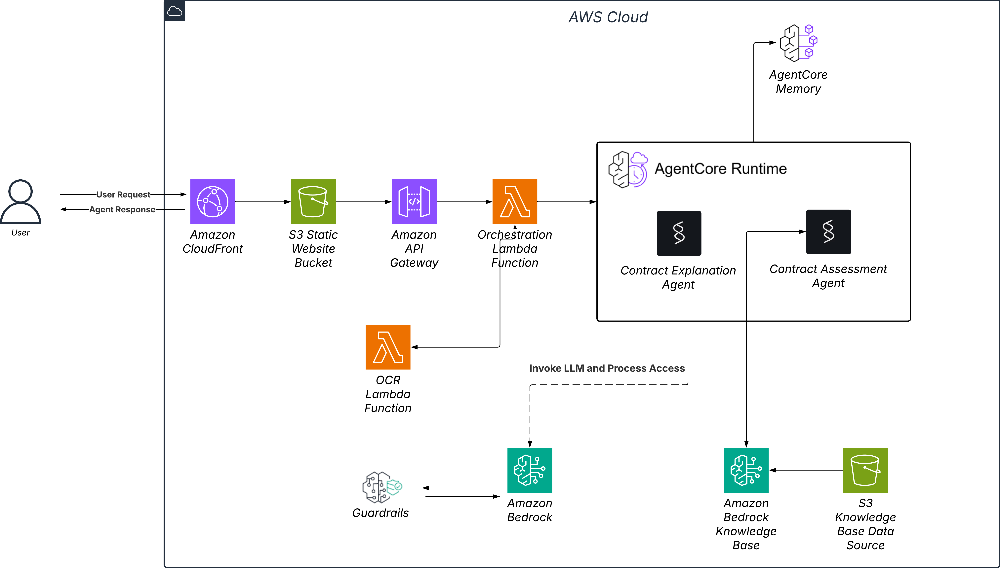

# 🏛️ Egyptian Legal Contract Analyzer - Tawtheeq AI

> **A comprehensive AWS-powered system for analyzing Egyptian legal contracts using AI and multi-agent architecture**

[](https://aws.amazon.com/)
[](https://python.org/)
[](https://aws.amazon.com/bedrock/)

## 🎯 Project Overview

An advanced AI-powered system that analyzes Egyptian legal contracts using AWS services. It provides comprehensive legal analysis, compliance checking, and risk assessment for Arabic legal documents.

## 🏗️ Architecture Overview



### System Components

- **Frontend**: Static web application hosted on S3 
- **API Layer**: AWS API Gateway with Lambda function integration
- **AI Processing**: AWS Bedrock AgentCore with specialized agents
- **OCR Service**: Separate Lambda function for image-to-text conversion using Claude Vision
- **Knowledge Base**: RAG-enhanced system with Egyptian legal document corpus

## 🌟 Key Features

### ✅ Implemented Features

1. **🔍 Advanced Arabic OCR**: High-accuracy text extraction from contract images
2. **🤖 Multi-Agent Analysis**: Specialized AI agents for different legal aspects
3. **⚖️ Egyptian Law Compliance**: Automated checking against Egyptian legal requirements
4. **🌐 Bilingual Support**: Analysis and reports in both Arabic and English
5. **⚡ Real-time Processing**: Fast analysis with cloud-native architecture

### Contract Analysis Modes
- **Explanation Mode**: Detailed contract breakdown and explanation
- **Assessment Mode**: Risk assessment and legal recommendations
- **Interactive Chat**: Follow-up questions with session-based conversation memory

## 🚀 Quick Start

### Prerequisites
- AWS Account with appropriate permissions
- Python 3.9+
- AWS CLI configured
- Access to AWS Bedrock AgentCore

### 1. Clone Repository
```bash
git clone [repository-url]
cd egyptian-legal-contract-analysis
```

### 2. Install Dependencies
```bash
pip install -r requirements.txt
```

### 3. Configure Environment
```bash
# Configure AWS CLI
aws configure

# Configure AgentCore
agentcore configure
```

### 4. Deploy Infrastructure
```bash
chmod +x deploy.sh
./deploy.sh
```

### 5. Deploy Lambda Functions
```bash
cd deployment

# Deploy main Lambda function
zip -r lambda-deployment.zip lambda_function.py
aws lambda create-function \
  --function-name egyptian-legal-contract-api \
  --runtime python3.9 \
  --role arn:aws:iam::YOUR-ACCOUNT:role/egyptian-legal-lambda-role \
  --handler lambda_function.lambda_handler \
  --zip-file fileb://lambda-deployment.zip

# Deploy OCR processor
zip -r ocr-deployment.zip ocr_processor.py
aws lambda create-function \
  --function-name ocr-processor \
  --runtime python3.9 \
  --role arn:aws:iam::YOUR-ACCOUNT:role/egyptian-legal-lambda-role \
  --handler ocr_processor.lambda_handler \
### 6. Deploy Website
```bash
# Upload website to S3
aws s3 cp production_website_aws.html s3://egyptian-legal-analysis-ui/production_website_aws.html

# Configure S3 for static website hosting
aws s3 website s3://egyptian-legal-analysis-ui --index-document production_website_aws.html
```

### 7. Configure API Gateway
Create API Gateway with the following endpoints:
- `GET /health` → Main Lambda
- `POST /api/analyze` → Main Lambda  
- `POST /api/ask` → Main Lambda
- `POST /api/ocr` → Main Lambda

Enable CORS for all endpoints.

## 🔧 Configuration

### Required IAM Permissions
The Lambda execution role needs permissions for:
- Bedrock AgentCore access
- Lambda function invocation
- CloudWatch logging
- S3 bucket access (for knowledge base only)

### Environment Variables
Set these in your Lambda functions:
- `AWS_REGION=us-west-2`
- `KNOWLEDGE_BASE_ID=QJWEBKNQ1N`

### Agent ARNs
Update these in `deployment/lambda_function.py`:
- Explanation Agent: `arn:aws:bedrock-agentcore:us-west-2:YOUR-ACCOUNT:runtime/memoryenhancedexplanation-XXXXX`
- Assessment Agent: `arn:aws:bedrock-agentcore:us-west-2:YOUR-ACCOUNT:runtime/memoryenhancedassessment-XXXXX`

## 📁 Project Structure

```
egyptian-legal-contract-analysis/
├── README.md                          # This file
├── requirements.txt                   # Python dependencies
├── production_website_aws.html        # Main website
├── lambda-trust-policy.json          # IAM trust policy
├── .bedrock_agentcore.yaml           # AgentCore configuration
├── architecture_diagram.png          # System architecture diagram
├── agents/                           # Agent configurations
│   ├── contract_explanation_agent.py
│   ├── contract_assessment_agent.py
│   └── contract_assessment_agent_rag.py
├── deployment/                       # Lambda deployment files
│   ├── lambda_function.py           # Main API Lambda
│   └── ocr_processor.py             # OCR processing Lambda
├── setup_aws_infrastructure.py      # Infrastructure setup
├── knowledge_base_manager.py        # Knowledge base management
├── create_simple_rag_agent.py      # RAG agent creation
└── deploy_agents.py                # Agent deployment
```

## 📊 API Documentation

### Health Check
```http
GET /health
Response: {"status": "healthy", "service": "Egyptian Legal Contract Analysis API"}
```

### Contract Analysis
```http
POST /api/analyze
Content-Type: application/json

{
  "analysis_type": "explanation|assessment",
  "contract_text": "نص العقد...",
  "user_id": "optional_user_id"
}
```

### Follow-up Questions
```http
POST /api/ask
Content-Type: application/json

{
  "question": "ما هي حقوق الموظف؟",
  "contract_text": "نص العقد...",
  "user_id": "user_id",
  "session_id": "session_id"
}
```

### OCR Processing
```http
POST /api/ocr
Content-Type: application/json

{
  "image_data": "data:image/jpeg;base64,/9j/4AAQ...",
  "auto_analyze": true,
  "analysis_type": "explanation"
}
```

## 🏛️ Egyptian Law Knowledge Base

Our system includes a list of comprehensive knowledge (for testing):
- **قانون العمل رقم 12 لسنة 2003** (Labor Law No. 12/2003)
- **القانون المدني المصري** (Egyptian Civil Code)  
- **قوانين العقارات والإيجارات** (Real Estate & Rental Laws)
- **القوانين التجارية** (Commercial Laws)
- **السوابق القضائية** (Legal Precedents)

## 🌐 Live Demo

- **Website**: https://egyptian-legal-analysis-ui.s3.amazonaws.com/production_website_aws.html
- **API Base URL**: https://820uxym01d.execute-api.us-west-2.amazonaws.com/prod

## 📝 Usage Examples

### 1. Contract Upload and Analysis
1. Visit the website
2. Select analysis type (Explanation or Assessment)
3. Upload contract image or paste text
4. Click "تحليل العقد" to get AI-powered analysis

### 2. Interactive Q&A
1. After analysis, ask follow-up questions
2. Get detailed responses based on contract content
3. Continue conversation with context preservation

### 3. OCR Text Extraction
1. Upload contract image
2. Click "استخراج النص ومعالجته"
3. Get extracted Arabic text
4. Optionally run automatic analysis

## 🔍 Monitoring and Debugging

### CloudWatch Logs
Monitor the following log groups:
- `/aws/lambda/egyptian-legal-contract-api`
- `/aws/lambda/ocr-processor`

### Common Issues
1. **AgentCore Not Available**: Check agent deployment and ARNs
2. **OCR Failures**: Verify image format and size
3. **CORS Errors**: Ensure proper API Gateway CORS configuration
4. **Memory Issues**: Increase Lambda memory allocation

## 🤝 Contributing

1. Fork the repository
2. Create a feature branch
3. Make your changes
4. Add tests for new functionality
5. Submit a pull request

## 📄 License

This project is licensed under the MIT License - see the LICENSE file for details.

---

Built with ❤️ using AWS Bedrock AgentCore and Claude AI


## 📝 Usage Examples# Prepare your legal documents for Knowledge Base

legal_documents = [

### 1. Contract Upload and Analysis    "egyptian-labor-law-12-2003.pdf",

1. Visit the website    "civil-code-provisions.pdf", 

2. Select analysis type (Explanation or Assessment)    "contract-templates.pdf",

3. Upload contract image or paste text    "legal-precedents.pdf"

4. Click "تحليل العقد" to get AI-powered analysis]


### 2. Interactive Q&A# Create Knowledge Base with proper chunking for Arabic

1. After analysis, ask follow-up questionskb_config = {

2. Get detailed responses based on contract content    "name": "QanuniEgyptianLawKB",

3. Continue conversation with context preservation    "description": "Egyptian legal documents and precedents",

    "dataSourceConfiguration": {

### 3. OCR Text Extraction        "type": "S3",

1. Upload contract image        "s3Configuration": {

2. Click "استخراج النص ومعالجته"            "bucketArn": "arn:aws:s3:::qanuni-legal-docs"

3. Get extracted Arabic text        }

4. Optionally run automatic analysis    },

    "vectorIngestionConfiguration": {

## 🤝 Contributing        "chunkingConfiguration": {

            "chunkingStrategy": "FIXED_SIZE",

1. Fork the repository            "fixedSizeChunkingConfiguration": {

2. Create a feature branch                "maxTokens": 300,  # Smaller chunks work better for Arabic

3. Make your changes                "overlapPercentage": 20

4. Add tests for new functionality            }

5. Submit a pull request        }

    }

## 📄 License}


This project is licensed under the MIT License - see the LICENSE file for details.

## 🆘 Support

For issues and questions:
1. Check the docs/ folder for detailed documentation
2. Review CloudWatch logs for debugging
3. Ensure all AWS services are properly configured
4. Verify agent deployment status

## 🔄 Data Flow

### Analysis Pipeline
```
Contract Text → AgentCore Agent → RAG Knowledge Base → Bedrock LLM → Enhanced Analysis
```

### OCR Pipeline  
```
Image Upload → OCR Processor → Claude Vision → Arabic Text → Optional Analysis
```

### Chat Pipeline
```
User Question → AgentCore (with memory) → RAG Enhancement → Contextual Response
```

---

Built with ❤️ using AWS Bedrock AgentCore and Claude AI
